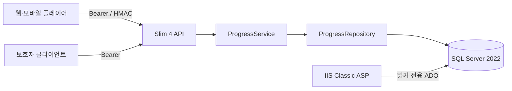

# EduSync Learning API

웹·모바일 플레이어의 학습 이벤트를 수집하고 강의별 진행 상태를 관리하는 API다. PHP 8.3, Slim 4, SQL Server 2022를 사용하며 멱등 처리, 늦게 도착한 이벤트, 동시 쓰기, 보호자 권한 조회를 다룬다. 기존 IIS 환경과 연동할 수 있도록 읽기 전용 Classic ASP 어댑터도 제공한다.

## 프로젝트 개요

| 항목 | 내용 |
| --- | --- |
| 프로젝트명 | EduSync Learning API |
| 개발 기간 | 2026-07-24 ~ 2026-07-26 |
| 주요 기술 | PHP 8.3, Slim 4, SQL Server 2022, Docker Compose |
| API 문서 | OpenAPI 3.0, Swagger UI |
| 호환 환경 | Windows IIS 10, Classic ASP |
| 라이선스 | MIT |

## 핵심 기능

- Bearer 인증을 사용하는 학습 이벤트 수집
- HMAC-SHA256 서명을 사용하는 플레이어 콜백 수신
- `(source, event_id)` 기준 멱등 처리와 충돌 감지
- 재생 위치, 최대 시청 위치, 최초 완료 시각의 독립적인 갱신
- 보호자·학습자 연결 관계를 확인하는 진행 조회
- SQL Server 잠금과 트랜잭션 재시도를 적용한 동시성 제어
- 로컬 Swagger UI와 재실행 가능한 통합·동시성 테스트

## 기술 스택

| 구분 | 기술 |
| --- | --- |
| API | PHP 8.3, Slim 4, PSR-7 |
| Database | SQL Server 2022, PDO_SQLSRV |
| 인증 | Bearer token, HMAC-SHA256 |
| 문서 | OpenAPI 3.0, Swagger UI 5.32.6 |
| 실행 환경 | Docker Compose, Apache |
| 호환 환경 | IIS 10, Classic ASP, ADO, Microsoft OLE DB Driver 19 |

## 시스템 구성



Slim API가 인증, 입력 검증과 쓰기 흐름을 담당한다. 진행 상태 조회만 필요한 IIS 환경은 별도의 Classic ASP 어댑터를 통해 SQL Server에 읽기 전용으로 접근한다.

## API

| Method | Endpoint | 인증 | 설명 |
| --- | --- | --- | --- |
| `GET` | `/health` | 없음 | API와 데이터베이스 상태 확인 |
| `POST` | `/api/v1/learning-events` | Bearer | 학습자와 source를 확인한 뒤 이벤트 수집 |
| `POST` | `/api/v1/player-events` | HMAC-SHA256 | 플레이어 콜백 서명 검증 후 이벤트 수집 |
| `GET` | `/api/v1/guardians/{guardianId}/learners/{learnerId}/progress` | Bearer | 보호자 연결 관계 확인 후 진행 상태 조회 |
| `GET` | `/progress.asp` | 없음 | 로컬 IIS에서 학습자·강의 진행 상태 조회 |
| `GET` | `/docs` | 없음 | 프로젝트에 포함된 Swagger UI 제공 |

HMAC canonical input은 `X-Player-Timestamp + "\n" + raw HTTP request body`이며, 서명 형식은 `sha256=<64 lowercase hex>`다. 입력 body는 서명 검증 전에 재직렬화하거나 공백을 정규화하지 않는다.

## 데이터 일관성

이벤트를 `learning_events`에 먼저 기록한 뒤 `lecture_progress` 행을 `UPDLOCK,HOLDLOCK`으로 잠그고 snapshot을 갱신한다. 이벤트와 snapshot은 하나의 트랜잭션으로 커밋되거나 함께 rollback된다.

동일한 `(source, event_id)`가 다시 들어오면 rollback 후 payload hash를 비교한다. 같은 payload는 멱등 응답을 반환하고 다른 payload는 409로 거부한다. SQL Server 오류 1205와 3960은 전체 트랜잭션을 한 번 재시도한다.

같은 session에서는 `(sequence_no, occurred_at, event_seq)`, 다른 session에서는 `(occurred_at, received_at, event_seq)`로 최신 이벤트를 결정한다. `resume_position_seconds`는 최신 이벤트를 따르고, `furthest_position_seconds`는 최댓값을 유지하며, `completed_at`은 최초 완료 시각만 보존한다.

## 프로젝트 구조

```text
public/             Slim 진입점과 Swagger UI
src/                인증, 입력 검증, 서비스와 저장소
db/                 SQL Server migration과 seed
legacy/             IIS Classic ASP 읽기 어댑터
tests/              계약, 통합, 동시성 테스트
scripts/            migration과 IIS 구성 스크립트
openapi.yaml        API 계약
docker-compose.yml  로컬 API·SQL Server 실행 구성
```

## 로컬 실행

`.env.example`을 복사한 뒤 로컬 개발용 비밀값을 설정한다. 예제의 정적 Bearer token과 HMAC secret은 운영 인증을 대체하지 않는다.

```powershell
Copy-Item .env.example .env
docker compose config --quiet
docker compose up --build -d
Invoke-RestMethod http://localhost:8080/health
```

정상 응답은 `database: connected`, `driver: pdo_sqlsrv`, `probe: 1`을 포함한다. 데이터베이스 연결이나 probe가 실패하면 `/health`는 내부 오류를 노출하지 않고 503 JSON을 반환한다.

Swagger UI는 `http://localhost:8080/docs`에서 확인할 수 있다.

## 테스트와 검증

```powershell
docker compose exec -T app composer validate --no-check-publish
docker compose exec -T app composer check-platform-reqs
docker compose exec -T app composer test
docker compose exec -T app composer audit
```

`composer test`는 Classic ASP 소스·JSON 계약, HTTP+SQL Server 통합 테스트, 실제 barrier 기반 동시성 테스트를 순서대로 실행한다. 테스트 fixture와 전용 table·trigger는 고유 식별자를 사용하고 `finally`에서 제거한다.

동시성 시나리오는 최초 snapshot 경쟁, 다중 checkpoint, 동일 payload 중복, 상충 payload, snapshot 실패 rollback, 실제 SQL Server deadlock과 재시도를 포함한다.

## 데모

```powershell
.\demo.ps1
Start-Process .\demo-result.html
```

스크립트는 Docker Compose, HTTP API, SQL Server에서 결과를 다시 읽어 `demo-result.html`을 생성한다. 보고서에는 비밀값과 HMAC 서명을 제외한 요청·응답, snapshot, 동시성 결과, Classic ASP 계약과 제한사항이 기록된다.

## Windows IIS와 Classic ASP

다음 스크립트는 관리자 권한으로 IIS 10, Classic ASP, Microsoft OLE DB Driver 19, localhost 전용 사이트와 조회 전용 SQL 로그인을 구성한다. Windows 선택 기능과 시스템 드라이버를 변경하므로 로컬 개발 환경에서만 실행해야 한다.

```powershell
$setup = (Resolve-Path .\scripts\setup-iis-classic-asp.ps1).Path
Start-Process powershell.exe -Verb RunAs -Wait -ArgumentList "-NoProfile -ExecutionPolicy Bypass -File `"$setup`""
```

기본 주소는 `http://127.0.0.1:8091`이다. 연결 문자열은 소스나 `.env`에 저장하지 않고 IIS 앱 풀 환경변수로 전달한다. Classic ASP 코드는 매개변수화된 ADO 쿼리와 조회 전용 SQL 계정을 사용한다.

## 문서

- [ARCHITECTURE.md](ARCHITECTURE.md): 컴포넌트 책임과 읽기·쓰기 경계
- [DECISIONS.md](DECISIONS.md): 주요 설계 결정과 trade-off
- [MYSQL_PORTABILITY.md](MYSQL_PORTABILITY.md): MySQL 이식 시 달라지는 동작
- [TROUBLESHOOTING.md](TROUBLESHOOTING.md): 해결한 장애와 재발 방지 기록

운영 사용자 인증, MySQL 런타임, 부하·용량 시험은 제공 범위에 포함되지 않는다. Classic ASP 런타임은 Windows IIS 설정 스크립트로 별도 구성하며, Compose 테스트는 해당 소스와 JSON 계약을 확인한다.

## License

애플리케이션 코드는 [MIT License](LICENSE)로 배포한다. `public/swagger-ui`의 Swagger UI 정적 자산은 [Apache License 2.0](public/swagger-ui/LICENSE)을 따르며, 해당 디렉터리에 [NOTICE](public/swagger-ui/NOTICE)를 포함한다.
